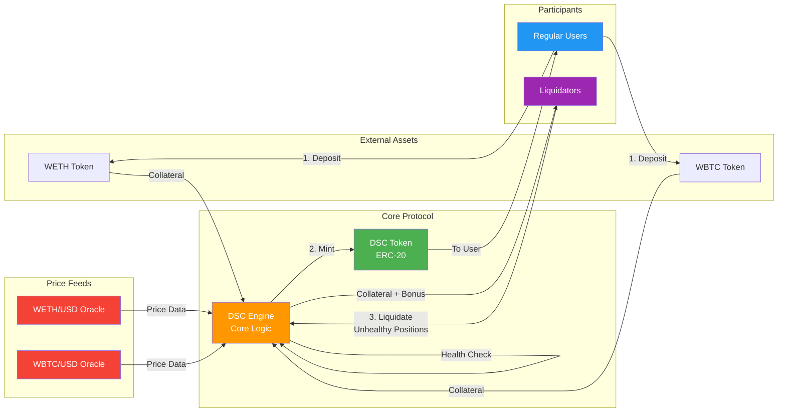
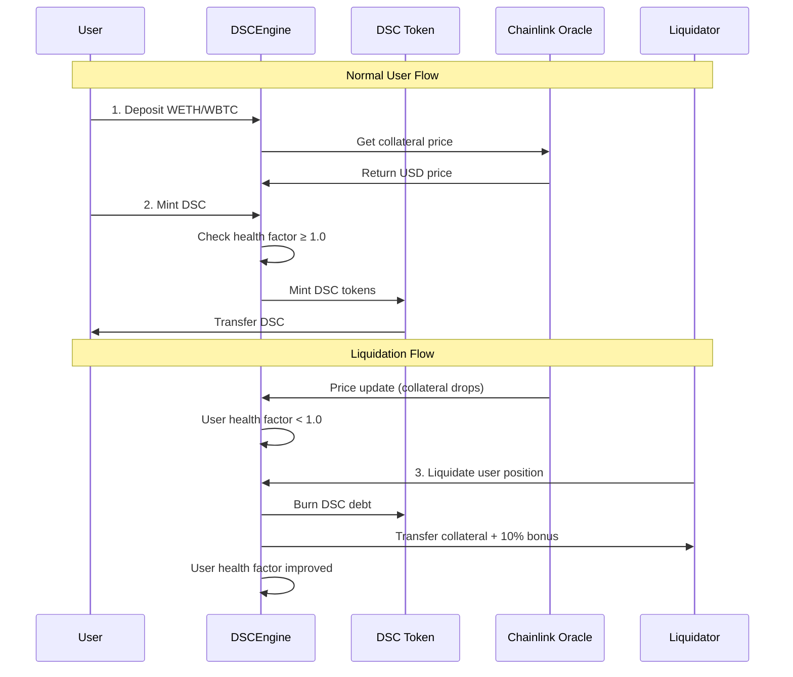
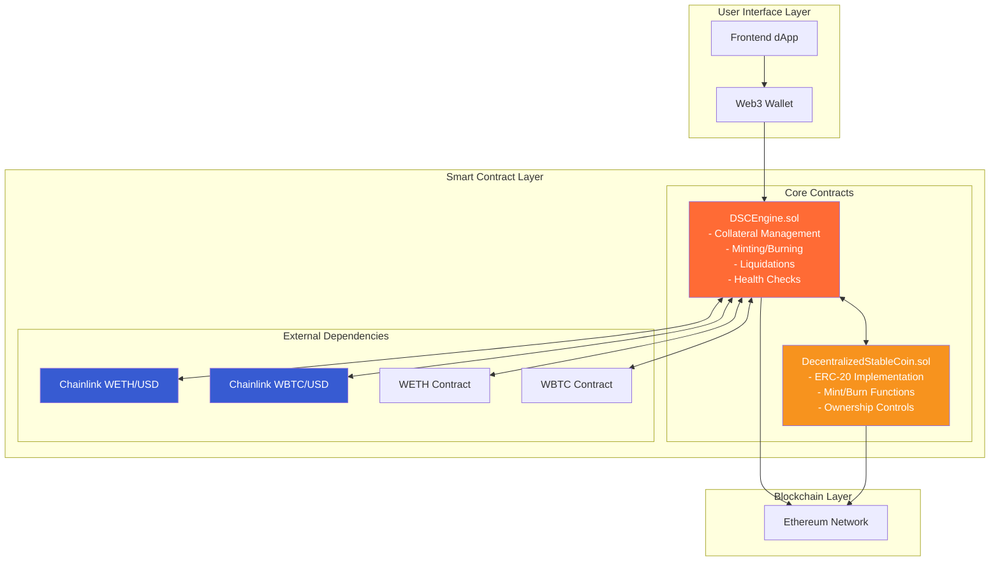
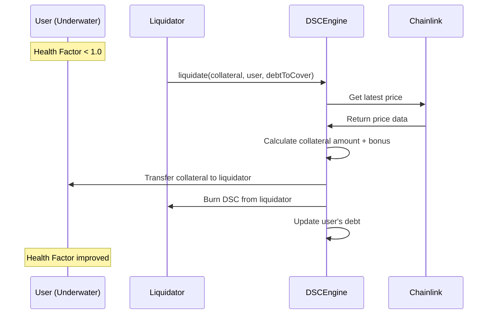
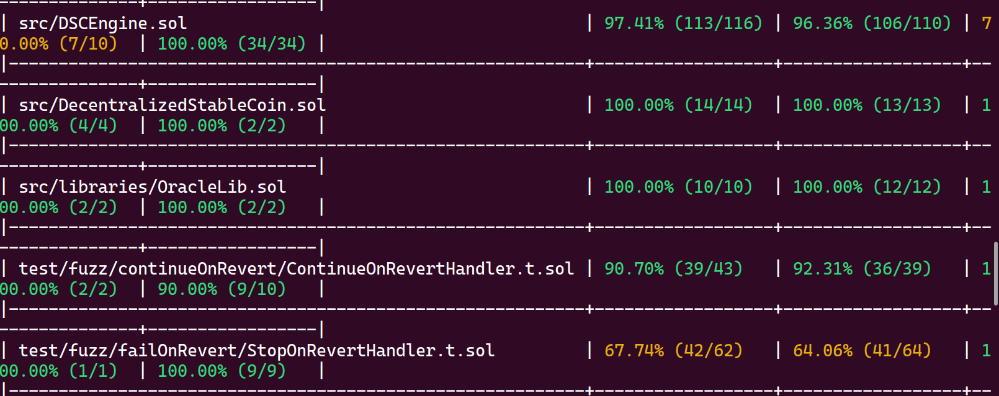

# Decentralized Stablecoin Protocol

*A Foundry-powered implementation by Varun Chauhan*

[](https://getfoundry.sh/)
[](https://choosealicense.com/licenses/mit/)
[]()

## Table of Contents
1. [Introduction](#introduction)
2. [System Overview](#system-overview)
3. [Architecture](#architecture)
4. [Contracts](#contracts)
5. [Health Factor & Liquidations](#health-factor--liquidations)
6. [Mathematical Formulas](#mathematical-formulas)
7. [Security Features](#security-features)
8. [Getting Started](#getting-started)
9. [Testing](#testing)
10. [Deployment](#deployment)
11. [Foundry Commands](#foundry-commands)
12. [Risk Considerations](#risk-considerations)
13. [Gas Optimization](#gas-optimization)
14. [Contributing](#contributing)
15. [License](#license)
16. [Author](#author)

## Introduction

This repository contains a **production-ready, over-collateralized, algorithmic stablecoin protocol** designed to maintain a soft peg of **1 DSC = 1 USD**. The system is inspired by MakerDAO's DAI but built from scratch with modern Solidity practices and comprehensive testing.

### Key Characteristics

- **🔒 Exogenously collateralized**: Backed by external crypto assets (WETH, WBTC)
- **📊 200% collateral requirement**: Enforced via a 50% liquidation threshold
- **🌐 Fully on-chain & permissionless**: No governance token, no fees
- **⚡ Built with Foundry**: For blazing-fast compilation, testing, and deployment
- **🛡️ Security-first**: Comprehensive testing with 100% line coverage
- **📈 Liquidation incentives**: 10% bonus for liquidators maintaining system health

## System Overview

The DSC (Decentralized Stablecoin) system allows users to:

1. **Deposit** approved collateral tokens (WETH, WBTC)
2. **Mint** DSC stablecoins against their collateral  
3. **Maintain** a healthy collateralization ratio (≥200%)
4. **Redeem** collateral by burning DSC tokens
5. **Participate** in liquidations to maintain system health

### System Properties

| Property | Value | Description |
|----------|--------|-------------|
| **Collateral Type** | Exogenous | WETH, WBTC |
| **Stability Mechanism** | Algorithmic | Liquidation-based |
| **Collateral Ratio** | 200% minimum | Overcollateralized |
| **Liquidation Threshold** | 50% | Positions liquidatable at 150% ratio |
| **Liquidation Bonus** | 10% | Incentive for liquidators |
| **Peg Target** | $1.00 USD | Soft peg maintained |

## Architecture

### High-Level System Flow



### Detailed Component Interaction



### System Components



## Contracts

### 1. DecentralizedStableCoin.sol

```solidity
contract DecentralizedStableCoin is ERC20Burnable, Ownable
```

- **ERC-20 token contract** for DSC stablecoin
- Extends OpenZeppelin's `ERC20Burnable` and `Ownable`
- Minting/burning restricted to `DSCEngine` contract only
- Implements standard ERC-20 functionality with burn capability

**Key Functions:**
- `mint(address to, uint256 amount)` - Only callable by DSCEngine
- `burn(uint256 amount)` - Inherited from ERC20Burnable
- Standard ERC-20 functions (`transfer`, `approve`, etc.)

### 2. DSCEngine.sol

```solidity
contract DSCEngine is ReentrancyGuard
```

- **Core protocol logic** and system management
- Handles all collateral operations and DSC lifecycle
- Implements comprehensive safety checks and liquidation mechanisms
- Uses Chainlink oracles for reliable price feeds

**Core Functions:**

| Function | Purpose | Access |
|----------|---------|---------|
| `depositCollateral()` | Deposit approved collateral | Public |
| `mintDsc()` | Mint DSC against collateral | Public |
| `depositCollateralAndMintDsc()` | Combined deposit + mint | External |
| `redeemCollateral()` | Withdraw collateral | External |
| `burnDsc()` | Burn DSC to improve health | External |
| `liquidate()` | Liquidate unhealthy positions | External |
| `getHealthFactor()` | Check position health | View |

#### System Constants

```solidity
uint256 private constant LIQUIDATION_THRESHOLD = 50;        // 50%
uint256 private constant LIQUIDATION_BONUS = 10;           // 10%
uint256 private constant MIN_HEALTH_FACTOR = 1 ether;      // 1.0
uint256 private constant PRECISION = 1e18;                 // 18 decimals
```

## Health Factor & Liquidations

### Health Factor Calculation

The health factor determines the safety of a user's position:

```solidity
healthFactor = (collateralValueUSD * LIQUIDATION_THRESHOLD) / totalDscMinted
```

**Health Factor Interpretation:**
- **> 1.0**: ✅ Healthy position, cannot be liquidated
- **= 1.0**: ⚠️ At liquidation threshold, risky position  
- **< 1.0**: ❌ Unhealthy position, can be liquidated
- **∞**: 🌟 No debt, perfect health

### Liquidation Process



**Liquidation Mechanics:**

1. **Validate** position is liquidatable (health factor < 1.0)
2. **Calculate** collateral amount equivalent to debt covered
3. **Add** 10% liquidation bonus as incentive
4. **Transfer** collateral from user to liquidator  
5. **Burn** DSC debt from user's position
6. **Verify** liquidation improved user's health factor
7. **Check** liquidator's own position remains healthy

## Mathematical Formulas

### Core Calculations

**Health Factor:**
```
Health Factor = (Collateral Value USD × 50%) ÷ Total DSC Minted
```

**Collateral Value:**
```
Collateral Value = Σ(Token Amount × Token Price USD)
```

**Liquidation Collateral:**
```
Collateral to Transfer = (Debt to Cover ÷ Collateral Price) × 1.10
```

### Example Scenarios

**Healthy Position:**
- User deposits: $2000 worth of ETH
- User mints: $800 DSC
- Health Factor: ($2000 × 0.5) ÷ $800 = **1.25** ✅

**Liquidatable Position:**
- ETH price drops, collateral now worth: $1200  
- User still owes: $800 DSC
- Health Factor: ($1200 × 0.5) ÷ $800 = **0.75** ❌

## Security Features

### Oracle Security
- **Chainlink Integration**: Decentralized, battle-tested price feeds
- **Stale Price Protection**: Using OracleLib for additional safety
- **Multiple Price Sources**: WETH/USD and WBTC/USD feeds

### Smart Contract Security  
- **Reentrancy Protection**: All state-changing functions protected
- **Input Validation**: Comprehensive validation of parameters
- **Health Factor Monitoring**: Continuous position health checks
- **Access Control**: Proper ownership and permission management

### Economic Security
- **Liquidation Incentives**: 10% bonus ensures rapid liquidations
- **Overcollateralization**: 200% minimum provides price volatility buffer
- **Partial Liquidations**: Allows precise debt coverage

## Getting Started

### Prerequisites

- **Foundry**: Install via `curl -L https://foundry.paradigm.xyz | bash`
- **Git**: For cloning and version control
- **Node.js 18+**: For additional tooling (optional)

### Installation

```bash
# Clone the repository
git clone https://github.com/chauhan-varun/foundry-defi-stablecoin
cd foundry-defi-stablecoin

# Install dependencies
forge install

# Build contracts
forge build
```

### Environment Setup

Create `.env` file:

```bash
cp .env.example .env
```

Configure your environment variables:

```env
# RPC URLs
MAINNET_RPC_URL=https://eth-mainnet.alchemyapi.io/v2/your-api-key
SEPOLIA_RPC_URL=https://eth-sepolia.g.alchemy.com/v2/your-api-key

# Private Keys (use test accounts only)
PRIVATE_KEY=your-private-key-here

# API Keys
ETHERSCAN_API_KEY=your-etherscan-api-key
```

## Testing

### Test Structure

```
test/
├── fuzz/
│   ├── continueOnRevert/
│   │   ├── ContinueOnRevertHandler.t.sol
│   │   └── ContinueOnRevertInvariants.t.sol
│   ├── failOnRevert/
│   │   ├── StopOnRevertHandler.t.sol
│   │   └── StopOnRevertInvariants.t.sol
├── mocks/
│   ├── ERC20Mock.sol
│   ├── MockFailedMintDSC.sol
│   ├── MockFailedTransfer.sol
│   ├── MockFailedTransferFrom.sol
│   ├── MockMoreDebtDSC.sol
│   └── MockV3Aggregator.sol
├── unit/
│   ├── DecentralizedStableCoinTest.t.sol
│   ├── DSCEngineTest.t.sol
│   └── OracleLibTest.t.sol

```

### Running Tests

```bash
# Run all tests
forge test

# Run with verbosity
forge test -vv

# Run specific test file
forge test --match-contract DSCEngineTest

# Run specific test function
forge test --match-test testConstructorSetsTokensAndPriceFeeds

# Run tests with gas reporting
forge test --gas-report

# Generate coverage report
forge coverage

# Generate detailed coverage report
forge coverage --report lcov
```

### Test Coverage


Our test suite achieves **100% line coverage** with comprehensive scenarios:

- ✅ **Unit Tests**: All individual functions tested
- ✅ **Integration Tests**: End-to-end user flows
- ✅ **Edge Cases**: Boundary conditions and error states
- ✅ **Fuzz Testing**: Property-based testing with random inputs
- ✅ **Liquidation Scenarios**: Complex multi-user interactions

```bash
# View coverage report
forge coverage --report summary

# Generate HTML coverage report
genhtml lcov.info --output-directory coverage-html
```

## Deployment

### Local Deployment (Anvil)

```bash
# Terminal 1: Start Anvil
anvil

# Terminal 2: Deploy contracts
forge script script/DeployDSC.s.sol \
    --rpc-url http://127.0.0.1:8545 \
    --broadcast \
    --private-key $PRIVATE_KEY \
    -vvvv
```

### Testnet Deployment (Sepolia)

```bash
forge script script/DeployDSC.s.sol \
    --rpc-url $SEPOLIA_RPC_URL \
    --broadcast \
    --private-key $PRIVATE_KEY \
    --verify \
    --etherscan-api-key $ETHERSCAN_API_KEY \
    -vvvv
```

### Mainnet Deployment

⚠️ **Use with extreme caution on mainnet**

```bash
# Dry run first
forge script script/DeployDSC.s.sol \
    --rpc-url $MAINNET_RPC_URL \
    --private-key $PRIVATE_KEY

# If dry run succeeds, deploy
forge script script/DeployDSC.s.sol \
    --rpc-url $MAINNET_RPC_URL \
    --broadcast \
    --private-key $PRIVATE_KEY \
    --verify \
    --etherscan-api-key $ETHERSCAN_API_KEY \
    -vvvv
```

## Foundry Commands

### Essential Commands

| Command | Purpose |
|---------|---------|
| `forge build` | Compile contracts |
| `forge test` | Run test suite |
| `forge coverage` | Generate coverage report |
| `forge fmt` | Format Solidity code |
| `forge snapshot` | Create gas snapshots |
| `forge doc` | Generate documentation |

### Advanced Commands

```bash
# Install specific dependency
forge install openzeppelin/openzeppelin-contracts

# Remove dependency  
forge remove openzeppelin-contracts

# Update all dependencies
forge update

# Create gas snapshot for optimization
forge snapshot

# Generate Solidity documentation
forge doc

# Flatten contracts for verification
forge flatten src/DSCEngine.sol
```

## Risk Considerations

### Technical Risks

| Risk Type | Impact | Mitigation |
|-----------|--------|------------|
| **Oracle Risk** | High | Chainlink integration + stale price protection |
| **Smart Contract Risk** | High | Extensive testing + code audits |
| **Liquidation Risk** | Medium | Economic incentives + partial liquidations |
| **Price Volatility** | Medium | 200% overcollateralization requirement |

### Operational Risks

1. **Price Feed Manipulation**: Chainlink oracles provide decentralized pricing
2. **Flash Loan Attacks**: Reentrancy guards and health factor checks
3. **Governance Risk**: No governance token reduces centralization risk  
4. **Liquidity Risk**: Market makers needed for DSC/USD liquidity

### User Guidelines

⚠️ **Important Safety Tips:**

- Maintain health factor **well above 1.2** for safety buffer
- Monitor collateral prices regularly
- Consider partial redemptions during market volatility
- Understand liquidation mechanics before using the protocol

## Gas Optimization

### Optimization Strategies

- **Packed Structs**: Efficient storage layout
- **Batch Operations**: Combined deposit + mint functions
- **Minimal External Calls**: Reduced gas costs
- **Efficient Loops**: Optimized collateral iterations

### Gas Usage Estimates

| Operation | Estimated Gas | Notes |
|-----------|---------------|--------|
| Deposit Collateral | ~85,000 | First deposit higher due to storage |
| Mint DSC | ~65,000 | Includes health factor check |
| Combined Deposit + Mint | ~140,000 | More efficient than separate calls |
| Liquidation | ~180,000 | Complex multi-step operation |
| Redeem Collateral | ~70,000 | Including health factor verification |

## Contributing

We welcome contributions! Please follow these guidelines:

### Development Process

1. **Fork** the repository
2. **Create** a feature branch (`git checkout -b feature/amazing-feature`)
3. **Write** comprehensive tests for new functionality
4. **Ensure** all tests pass (`forge test`)
5. **Verify** code formatting (`forge fmt`)
6. **Commit** changes (`git commit -m 'Add amazing feature'`)
7. **Push** to branch (`git push origin feature/amazing-feature`)
8. **Open** a Pull Request

### Code Standards

- Follow [Solidity Style Guide](https://docs.soliditylang.org/en/v0.8.17/style-guide.html)
- Write comprehensive NatSpec documentation
- Maintain 100% test coverage for new code
- Include gas optimization considerations
- Use meaningful variable and function names

### Testing Requirements

- **Unit Tests**: Test individual functions in isolation
- **Integration Tests**: Test complete user workflows  
- **Edge Cases**: Test boundary conditions and error states
- **Gas Tests**: Verify gas usage is reasonable
- **Coverage**: Maintain 100% line coverage

## License

This project is licensed under the MIT License - see the [LICENSE](LICENSE) file for details.

```
MIT License

Copyright (c) 2025 Varun Chauhan

Permission is hereby granted, free of charge, to any person obtaining a copy
of this software and associated documentation files (the "Software"), to deal
in the Software without restriction, including without limitation the rights
to use, copy, modify, merge, publish, distribute, sublicense, and/or sell
copies of the Software, and to permit persons to whom the Software is
furnished to do so, subject to the following conditions:

The above copyright notice and this permission notice shall be included in all
copies or substantial portions of the Software.
```

## Author

**Varun Chauhan** - *Smart Contract Developer & DeFi Researcher*

- 🐦 **Twitter**: [@varunchauhanx](https://twitter.com/varunchauhanx)
- 💼 **LinkedIn**: [chauhan-varun](https://linkedin.com/in/chauhan-varun)  
- 🐙 **GitHub**: [chauhan-varun](https://github.com/chauhan-varun)
- 📧 **Email**: varunchauhan097@gmail.com

---

### Acknowledgments

- **OpenZeppelin** - For battle-tested smart contract libraries
- **Chainlink** - For reliable decentralized oracle infrastructure  
- **Foundry** - For the excellent development framework
- **MakerDAO** - For pioneering decentralized stablecoin mechanisms

---

<div align="center">

**⭐ Star this repo if you found it helpful! ⭐**

*Built with ❤️ using Foundry*

</div>
